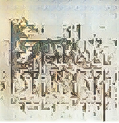

# VAHA - Visual Artwork for Human Affections
 
**[NYU Tandon, Deep Learning for Media Final Project]**

[Liqian Zhang](), [Yunfeng Qi](), [Joanne Tang]()

[[`Demo`](https://colab.research.google.com/drive/1sGToDW9JF8Q5iSagNdZ5_ornuEncvPl5?usp=sharing)]

