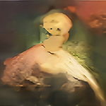
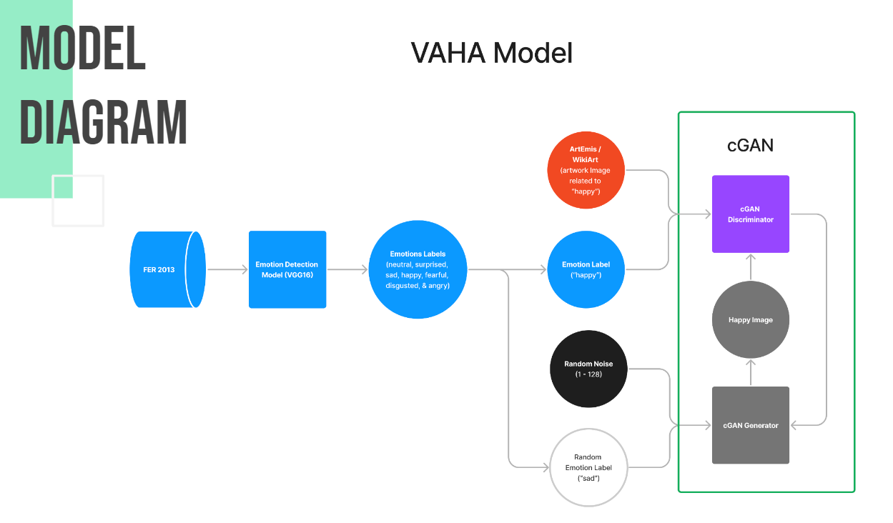

# VAHA - Visual Artwork for Human Affections
 
**[NYU Tandon, Deep Learning for Media Final Project]**

[Liqian Zhang](), [Yunfeng Qi](), [Joanne Tang]()

[[`Demo`](https://colab.research.google.com/drive/1sGToDW9JF8Q5iSagNdZ5_ornuEncvPl5?usp=sharing)]
[[`Presentation`]()]




## Introduction

The **Visual Artwork for Human Affections(VAHA)** is ...(Intro here)

Check our demo on how to use. 

## Dataset

We used [[`FER-2013 Dataset`](https://www.kaggle.com/datasets/ananthu017/emotion-detection-fer?select=train)] to trained our emotion detector. And we used [[`Wiki-art Dataset`](https://www.kaggle.com/datasets/steubk/wikiart)] with [[`Artemis`](https://www.artemisdataset.org/)] annotated labels to trained our cGAN model. 

## Models 

### Emotion detector 

Through our [[model experiment](https://github.com/zxxwxyyy/VAHA/blob/main/Notebooks/VAHA_emotion_detect_model_experiment.ipynb)], we notice [[`vgg16`](https://keras.io/api/applications/vgg/)] offers the best performance. So we set all layers to trainable, and trained it with FER-2013 dataset for 20 epochs to adpat features on our specific needs. 


<!--  -->

### Conditional Generative Adversarial Network (cGAN)

Our VAHA model is trained on [[`Wiki-art Dataset`](https://www.kaggle.com/datasets/steubk/wikiart)] with [[`Artemis`](https://www.artemisdataset.org/)] emotion labels. Our generator takes random noise and a class label as input, and generates images conditioned on the class label. The label embedding and concatenation layers allows the generator to incorporate the class label information into generated image, making the output class specificed. 



### Citation 

Big thanks to all resources we've been used: 

Artemis:
```
     @article{achlioptas2021artemis,
                title={ArtEmis: Affective Language for Visual Art},
                author={Achlioptas, Panos and Ovsjanikov, Maks and Haydarov,
                        Kilichbek and Elhoseiny, Mohamed and Guibas, Leonidas},
                journal = {CoRR},
                volume = {abs/2101.07396},
                year={2021}}
```

Real-ESRGAN: 
```
@InProceedings{wang2021realesrgan,
    author    = {Xintao Wang and Liangbin Xie and Chao Dong and Ying Shan},
    title     = {Real-ESRGAN: Training Real-World Blind Super-Resolution with Pure Synthetic Data},
    booktitle = {International Conference on Computer Vision Workshops (ICCVW)},
    date      = {2021}
}
```

