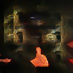

# VAHA - Visual Artwork for Human Affections
 
**[NYU Tandon, Deep Learning for Media Final Project]**

[Liqian Zhang](), [Yunfeng Qi](), [Joanne Tang]()

[[`Demo`](https://colab.research.google.com/drive/1sGToDW9JF8Q5iSagNdZ5_ornuEncvPl5?usp=sharing)]

## Introduction

The **Visual Artwork for Human Affections(VAHA)** is ...(Intro here)

Check our demo on how to use. 

## Dataset

We used [[`FER-2013 Dataset`](https://www.kaggle.com/datasets/ananthu017/emotion-detection-fer?select=train)] to trained our emotion detector. And we used [[`Wiki-art Dataset`](https://www.kaggle.com/datasets/steubk/wikiart)] with [[`Artemis`](https://www.artemisdataset.org/)] annotated labels to trained our cGAN model. 

## Models 

### Emotion detector 

Through our [[model experiment](https://github.com/zxxwxyyy/VAHA/blob/main/Notebooks/VAHA_emotion_detect_model_experiment.ipynb)], we notice [[`vgg16`](https://keras.io/api/applications/vgg/)] offers the best performance. So we set all layers to trainable, and trained it with FER-2013 dataset for 20 epochs to adpat features on our specific needs. 

