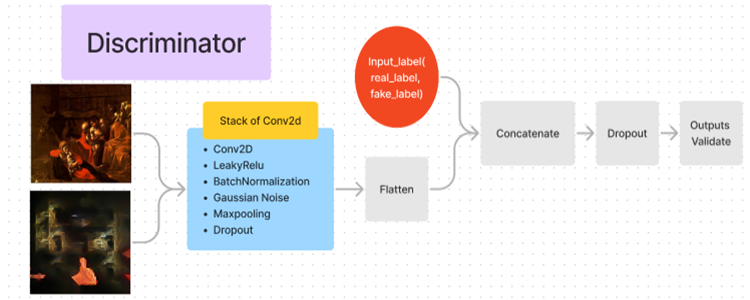

# VAHA - Visual Artwork for Human Affections
 
[NYU Tandon, Deep Learning for Media Final Project]

[Liqian Zhang](https://github.com/zxxwxyyy), [Yunfeng Qi](https://github.com/fysta), [Joanne Tang](https://github.com/Joannetang07)

[[`Demo`](https://colab.research.google.com/drive/1xNkJF6oxaU_dMSq51RtL7SLM2lHjvKBl?usp=sharing)]
[[`Presentation`](https://docs.google.com/presentation/d/1ZYf7WW_uSSE5V4EUYXyrYrDDmwPbSk9NadjnbihCkDs/edit?usp=sharing)]

## **Introduction**

The **Visual Artwork for Human Affections(VAHA)** is an innovative model designed to explore the intersection of creativity, human emotions, and artificial intelligence to revolutionize the way we understand and express our emotions. Our goal is to provide a deeper understanding of the complexity of human emotions by automating the generation of abstract visual artwork using emotion recognition and image generation techniques.

The **VAHA** model integrates two established models: the VGG16 and the GAN. The VGG16, a Convolutional Neural Network (CNN) model, is specifically adapted for facial recognition in our system. The GAN (Generative Adversarial Network) model is responsible for generating the visual art images by integrating the classifications of human emotions obtained from the VGG16 model. **The VAHA model can produce captivating artistic representations of various emotional states, incorporating a diverse range of associated artistic styles.**

Check our [[`Demo`](https://colab.research.google.com/drive/1xNkJF6oxaU_dMSq51RtL7SLM2lHjvKBl?usp=sharing)] on how to use. 

## **Pipeline** 

The first step in the pipeline involves capturing the user's facial expression through a webcam. We employ a real-time video feed, accessed using OpenCV library to detect and extract the user's face from the video frame. The captured facial expression will be used as input for the subsequent emotion detection step.

Once the facial expression is captured, we employ the VGG16 convolutional model for emotion classification. The captured face is pre-processed and fed into a pre-trained VGG16 model, which has been fine-tuned for emotion recognition. The model classifies the input image into one of the emotion categories, such as happy, sad, or angry.

With the detected emotion, we condition the GAN model to generate new artistic images that correspond to the identified emotion. The GAN consists of a generator network that creates images and a discriminator network that evaluates their authenticity. By providing the detected emotion as label embedding, the generator is guided to produce artworks that match the desired emotional state.

To evaluate the performance of the GAN model and select the best generated images, we use the Artemis model to classify the synthesized artworks into emotion categories. By comparing the classification results with the desired emotion, we can assess the GAN's ability to generate emotion-driven images. We then select the highest-quality images based on this evaluation.

In the final step, we employ a denoising model to upscale and improve the visual quality of the generated images. This model is designed to remove artifacts and noise while preserving important graphic features and details. As a result, the final output consists of high-resolution, artistic images that correspond to the user's initial emotional state.

## **Dataset**

We utilized the [[`FER-2013 Dataset`](https://www.kaggle.com/datasets/ananthu017/emotion-detection-fer?select=train)] to train our emotion detector, while the [[`Wiki-art Dataset`](https://www.kaggle.com/datasets/steubk/wikiart)] combined with [[`Artemis`](https://www.artemisdataset.org/)] annotated labels were employed to train our cGAN model.

## **Models** 

### Emotion detector 

Through our [[model experiment](https://github.com/zxxwxyyy/VAHA/blob/main/Notebooks/(Part1)VAHA_emotion_detect_model_experiment.ipynb)], we observed that [[`vgg16`](https://keras.io/api/applications/vgg/)] yielded the best performance. Consequently, we set all layers to trainable and fine-tuned the model with the FER-2013 dataset for 20 epochs to adapt the features to our specific requirements. 

<!--  -->

### Conditional Generative Adversarial Network (cGAN)

Our VAHA model is trained on [[`Wiki-art Dataset`](https://www.kaggle.com/datasets/steubk/wikiart)] with [[`Artemis`](https://www.artemisdataset.org/)] emotion labels. The generator accepts random noise and a class label as inputs, generating images conditioned on the class label. The label embedding and concatenation layers enable the generator to integrate class label information into the generated image, ensuring class-specific outputs. You may find our process in our [[notebook](https://github.com/zxxwxyyy/VAHA/blob/main/Notebooks/(Part3)VAHA_cGAN_experiment.ipynb)].

### Artemis pre-trained model

The output images from our model can be highly diverse. To filter the best results, we pass all generated images through the [[`Artemis`](https://github.com/optas/artemis)] pre-trained model and select the top 3 images with the highest prediction probabilities as outputs.

### Real-ESRGAN denoising model 

Due to limited computing resources, the output images from our cGAN are 64x64x3 in size. We therefore process our output images using the [[`Real-ESRGAN`](https://github.com/xinntao/Real-ESRGAN)] denoising model to further enhance and produce high-quality images.
